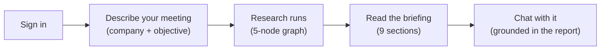
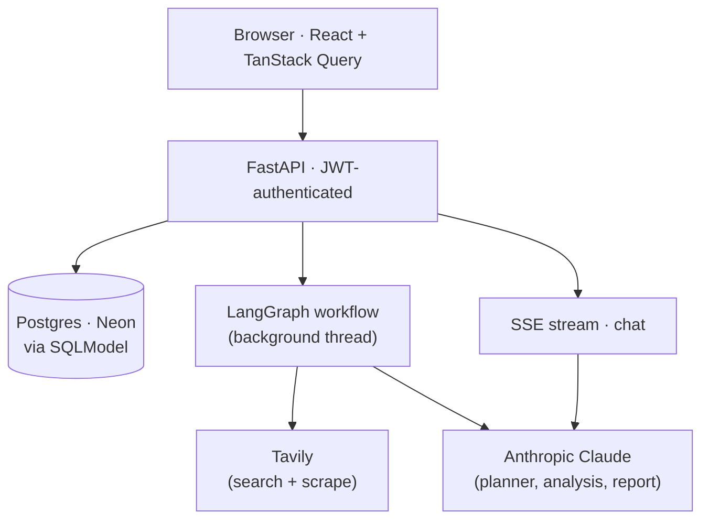

# Dossi

**Meeting prep that reads like you spent an afternoon doing the homework.**

**[Live app](https://dossi-frontend.onrender.com)** · **Demo video** _(coming soon)_

Drop in a company name, website, and meeting objective. Dossi researches the company and comes back with a nine-section briefing: overview, products, customers, business signals, risks, discovery questions, outreach strategy, unknowns, and sources. Then you can chat with the briefing — draft an email, prep talking points, or dig into anything that surfaced.

The idea behind every decision: this is a **research pipeline, not a form**. One run does the work, and the whole product exists to make that run good:

```
research(company, website, objective) → briefing + chat
```

---

## How it works



### 1. Sign in

Email and password. Every session, message, and report is scoped to the signed-in user, checked on every request.

### 2. Describe your meeting

Company name, website URL, and what you are trying to accomplish in the call. That is enough — Dossi figures out what to look for.

### 3. Research runs

A five-node **LangGraph** graph runs in a background thread: **planner** (turns your objective into a research plan), **research** (Tavily search + site scrape), **analysis** (synthesises findings), **quality check** (evaluates coverage and decides whether to retry), **report generation** (writes the final briefing). The browser polls `/status` every two seconds and shows a live progress bar. If coverage is thin, the graph retries automatically — up to two passes.

### 4. Read the briefing

Nine sections land all at once: overview, products and services, target customers, business signals, risks and challenges, discovery questions, outreach strategy, unknowns, and sources. Unknowns surface what the agent couldn't find, so you know exactly where the gaps are.

### 5. Chat with the briefing

An SSE-streamed chat panel opens alongside the report. Every answer is grounded entirely in the briefing — the model has no access to outside knowledge, so it can't invent facts. Use it to draft an email opener, prep answers to hard questions, or compare two sections of the report.

---

## Architecture

A **FastAPI** backend and a **React + Vite** frontend deployed separately on **Render**. A request flows like this:



**Auth.** JWT (HS256) with bcrypt password hashing via passlib. The access token is sent as a Bearer header on every request; the user id is re-checked inside every route handler, not only in middleware.

**Research graph.** The five-node LangGraph graph runs once per session in a daemon thread. The planner node turns the objective into a structured research plan; the research node executes Tavily searches and a website scrape in sequence; analysis and quality check decide whether a retry is needed; report generation writes the final nine-section briefing. State is checkpointed to the same Postgres database, so a crashed thread can resume. The quality-check node evaluates coverage and sets a `verdict` field — `pass` proceeds to the report, `retry` loops back to research with targeted gap queries (max two passes).

**Provider abstraction.** Research can be backed by Tavily (default) or Firecrawl, selected by the `RESEARCH_PROVIDER` env var. The LLM is similarly swappable between Anthropic and OpenAI. Each provider is a class implementing the same interface, so swapping is a one-line env change.

**Chat.** The chat endpoint streams tokens via SSE, grounded with the full report JSON as context. The frontend uses an `AbortController` tied to component unmount so streams are cancelled cleanly on navigation. Only complete, non-errored replies are persisted to the database.

**Security hardening.** SSRF protection rejects private/loopback IPs before any scrape. Input validation strips control characters and enforces length limits on all user-supplied fields. Markdown from the assistant is sanitised through DOMPurify with a strict tag allowlist before it is rendered as HTML.

---

## Run locally

### Prerequisites

- Python 3.12+
- Node 18+ / npm
- API keys: **Anthropic** (LLM) and **Tavily** (web research)

### Backend

```bash
cd backend
python -m venv .venv && source .venv/bin/activate
pip install -r requirements.txt

cp .env.example .env
# Fill in:
#   LLM_API_KEY=sk-ant-...
#   TAVILY_API_KEY=tvly-...
#   JWT_SECRET=any-long-random-string

uvicorn app.main:app --reload --port 8000
```

### Frontend

```bash
cd frontend
npm install
npm run dev      # http://localhost:3000
```

Sign up at `http://localhost:3000`, enter a company and objective, and run your first research session.

### Standalone workflow (no frontend needed)

```bash
cd backend && source .venv/bin/activate
python -m app.workflow.run_workflow \
  --company "Notion" \
  --website "https://notion.so" \
  --objective "Sell them our enterprise SSO integration"
```

### Tests

```bash
cd backend && source .venv/bin/activate
pip install -r requirements-dev.txt
pytest
```

The suite covers the LangGraph retry routing, auth, session ownership and validation, SSRF guards, and input sanitisation. It uses an isolated SQLite database and stubs the workflow launch, so it runs in seconds with no network calls.

---

## Environment variables

| Variable             | Required     | Default                 | Notes                                           |
| -------------------- | ------------ | ----------------------- | ----------------------------------------------- |
| `LLM_API_KEY`        | yes          | —                       | Anthropic key (`sk-ant-...`)                    |
| `LLM_PROVIDER`       | no           | `anthropic`             | or `openai`                                     |
| `LLM_MODEL`          | no           | `claude-opus-4-8`       | Use `claude-sonnet-4-6` in production           |
| `TAVILY_API_KEY`     | yes          | —                       | Tavily search + scrape                          |
| `RESEARCH_PROVIDER`  | no           | `tavily`                | or `firecrawl`                                  |
| `FIRECRAWL_API_KEY`  | if firecrawl | —                       |                                                 |
| `DATABASE_URL`       | no           | `sqlite:///./dossi.db`  | Neon Postgres URL for production                |
| `JWT_SECRET`         | yes          | —                       | Any long random string (required in production) |
| `JWT_EXPIRY_MINUTES` | no           | `60`                    |                                                 |
| `CORS_ORIGINS`       | no           | `http://localhost:3000` | Comma-separated list                            |

---

## Deploy

Free-tier deploy on **Neon** (Postgres) + **Render** (backend and frontend). The repo ships a `render.yaml` blueprint and a keep-warm pinger. Full steps in [docs/deployment.md](docs/deployment.md).

1. **Neon** — create a Postgres project, copy the connection string, change its prefix to `postgresql+psycopg://`. Tables create themselves on first boot.
2. **Backend (Render)** — New > Blueprint > this repo. Fill in `LLM_API_KEY`, `TAVILY_API_KEY`, `JWT_SECRET`, `DATABASE_URL`, `CORS_ORIGINS`. Set `LLM_MODEL=claude-sonnet-4-6` for production.
3. **Frontend (Render static site)** — set `VITE_API_URL` to the backend URL. The SPA rewrite is preconfigured.

> Render free services cold-start after ~15 min idle. `.github/workflows/keepalive.yml` pings `/health` every 10 minutes once you set a `BACKEND_URL` repo secret.

---

## What I'd build next

- [ ] Source transparency panel — show which queries ran and let users add URLs before the report generates
- [ ] Post-meeting notes → delta briefing: paste what happened, get a diff of what changed and what to follow up on
- [ ] Quick brief mode — 90 seconds, three sections, no retry loop (what they do, who they sell to, one opener)
- [ ] CRM export — one-click structured note into HubSpot or Salesforce
- [ ] Mobile layout — reps prep on the move; the current layout is desktop-only
- [ ] Competitor comparison — research added competitors in parallel and add a comparison section to the report
